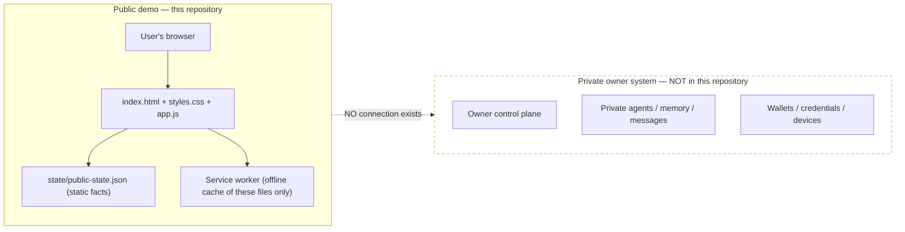

# 8x8 User Edition Public Beta Architecture

## Purpose

The public beta is a static, public-safe visualization of the 8x8 OS operating model. It provides a fast cockpit, agent-role explanations, an evidence ladder, a conceptual world layer, a roadmap and explicit security boundaries.

It is **not** the private 8x8 control plane and has no channel to private repositories, credentials, wallets, memory, messages, devices or services.

## Runtime

```text
Browser
  ├── index.html
  ├── styles.css
  ├── app.js
  ├── state/public-state.json
  ├── manifest.webmanifest
  └── service worker cache
```

The first beta has no backend, database, API keys, wallet connection, analytics SDK, remote shell, trading route, device telemetry or hidden background compute.

## Public/private boundary diagram

The diagram below shows the entire public system (left) and the hard boundary to the private owner system (right). There is no arrow crossing the boundary: the public cockpit has no code path, credential or connector that reaches any private component.



**Text alternative:** a user's browser loads three static files (HTML, CSS, JavaScript) plus a static JSON facts file, and a service worker caches those same files for offline viewing. A separate private owner system — control plane, private agents, memory, messages, wallets, credentials and devices — sits entirely outside this repository, and no connection of any kind exists between the two.

## Public interaction model

All interactions are local UI behavior:

- switching cockpit views;
- opening public agent-archetype descriptions;
- exploring the evidence ladder;
- viewing the conceptual spatial map;
- installing the progressive web app shell;
- caching public static assets for offline viewing.

No interaction mutates an external service.

## Evidence model

Public capabilities are classified separately as:

1. `CLAIMED`
2. `DESIGNED`
3. `IMPLEMENTED`
4. `TESTED`
5. `RECEIPT_VERIFIED`
6. `RUNNING`
7. `DEPLOYED`
8. `RELEASED`
9. `ADOPTED`

A visual element or source file must not be presented as proof of a private runtime, productive agent or production service.

## Future expansion gates

A later version may add accounts, entitlements, public APIs, isolated workspaces, voluntary user nodes and signed installers only after separate security, privacy, reliability, legal and owner approvals.

The following remain independently consented and revocable:

```text
installation
node enrollment
compute contribution
storage contribution
telemetry
remote support
rewards participation
```

## Deployment requirements

A public deployment must:

- serve only the contents of this public repository;
- enforce the security headers in `vercel.json` or an equivalent configuration;
- preserve `state/public-state.json` without silently changing false assertions to true;
- use HTTPS;
- expose no environment variables or server source files;
- pass the repository validation workflow;
- retain a clear beta and demo-only label.
